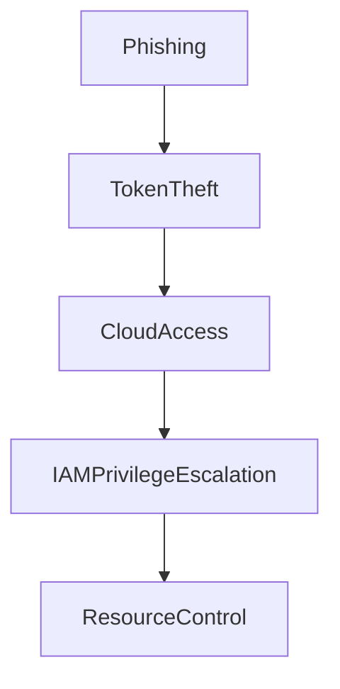

# 🛡️ José María Micoli

### Senior Offensive Security Engineer  
Red Team • Adversary Emulation • Security Validation Engineering  
Identity Attack Modeling • API Security • Cloud & Detection Validation

---

# Offensive Security Engineering Portfolio

I design adversary tradecraft and offensive security platforms to measure **defensive effectiveness in modern enterprise environments.**

My work focuses on structured **adversary simulation and continuous security validation**, bridging:

• Red Team operations  
• Detection engineering validation  
• Identity attack-path modeling  
• API security testing  
• Cloud IAM abuse simulation  
• SOC detection capability measurement  

The objective is **not compromise demonstration.**

The objective is **defensive assurance through measurable attacker simulation.**

---

# Executive Overview

Modern organizations deploy increasingly complex security stacks:

• EDR  
• SIEM  
• IAM  
• Cloud security controls  
• API gateways  
• Zero-trust architectures  

However, most security programs still rely on **point-in-time penetration testing**.

This creates a fundamental question:

> Do these controls actually work against real adversary behavior?

This portfolio contains research platforms, adversary simulation infrastructure, and offensive engineering tooling designed to **continuously validate security controls under realistic attacker tradecraft.**

---

# Strategic Security Platforms

Security engineering platforms designed to operationalize **continuous adversary simulation and security validation.**

| Platform | Domain | Purpose |
|--------|--------|--------|
| VectorVue | Security Validation | Continuous control validation & compliance mapping |
| SpectraStrike | Red Team Orchestration | Structured adversary simulation campaigns |
| VaporTrace | API Risk Intelligence | Automated API attack-path discovery |
| VaporLab | API & AI Exploitation | Offensive research and testing environment |
| Ghost-Pipeline | CI/CD Security | OIDC token abuse & supply-chain simulation |
| APEX-PRO | Ransomware Emulation | Incident response readiness measurement |
| Hydra-C2 | Red Team Infrastructure | Multi-platform command and control |
| Hydra-Worm | Adversarial Propagation | Lateral movement & segmentation testing |
| Nyxera Eye | IoT / ICS Intelligence | Global attack surface discovery |
| Log4Shell-PoC | Vulnerability Research | Detection validation and WAF analysis |
| Pentest Reports Portfolio | Security Reporting | Executive-grade reporting models |
| Adversary Simulation Lab | Red Team Lab | Structured adversary training infrastructure |

These systems bridge **offensive execution with detection engineering and governance-level security intelligence.**

---

# Adversary Infrastructure Architecture

Example adversary infrastructure used in Red Team simulations.

```mermaid
flowchart TD

Operator[Red Team Operator]

Operator --> C2Framework
C2Framework --> Redirector
Redirector --> PayloadServer
PayloadServer --> TargetEnvironment

TargetEnvironment --> AD
TargetEnvironment --> Cloud
TargetEnvironment --> APIs

AD --> LateralMovement
Cloud --> IAMAbuse
APIs --> AuthorizationAbuse
````

This infrastructure supports simulations of:

• Identity privilege escalation
• API authorization attacks
• Cloud IAM abuse
• lateral movement campaigns
• command-and-control detection testing

---

# Adversary Simulation Workflow

Structured offensive methodology used across projects.

```mermaid
flowchart TD

Recon[Reconnaissance]

Recon --> Weaponization
Weaponization --> InitialAccess
InitialAccess --> PrivEsc
PrivEsc --> LateralMove
LateralMove --> Persistence
Persistence --> CommandControl
CommandControl --> Impact
Impact --> DetectionValidation
```

Each phase is mapped to **MITRE ATT&CK** techniques and detection validation objectives.

---

# MITRE ATT&CK Coverage

The adversary simulation platforms in this portfolio map offensive activity to **ATT&CK tactics and techniques** to measure defensive visibility.

| ATT&CK Phase         | Example Techniques Simulated     |
| -------------------- | -------------------------------- |
| Reconnaissance       | T1595 Active Scanning            |
| Initial Access       | T1566 Phishing                   |
| Execution            | T1059 Command Execution          |
| Persistence          | T1547 Boot or Logon Autostart    |
| Privilege Escalation | T1068 Exploitation               |
| Defense Evasion      | T1070 Indicator Removal          |
| Credential Access    | T1003 Credential Dumping         |
| Discovery            | T1087 Account Discovery          |
| Lateral Movement     | T1021 Remote Services            |
| Command & Control    | T1071 Application Layer Protocol |
| Exfiltration         | T1041 Exfiltration Over C2       |
| Impact               | T1486 Data Encryption for Impact |

---

# Detection Validation Framework

Offensive simulations are used to measure **security control performance** across detection layers.

| Security Control    | Validation Objective           |
| ------------------- | ------------------------------ |
| EDR                 | Behavioral detection coverage  |
| SIEM                | Correlation rule effectiveness |
| NGFW                | Network anomaly detection      |
| Identity Monitoring | Privilege abuse detection      |
| API Gateways        | Authorization bypass detection |
| Cloud Security      | IAM abuse monitoring           |

---

# Identity-Centric Attack Modeling

Modern breaches frequently originate from **identity abuse rather than vulnerabilities**.

Example attack path simulation:



This model allows organizations to evaluate:

• OAuth / OIDC token abuse
• cross-account IAM privilege escalation
• federation trust boundary exploitation

---

# API Security Validation Model

API security simulations focus on **authorization logic abuse** rather than traditional injection vulnerabilities.

Key attack patterns tested:

• Broken Object Level Authorization (BOLA)
• Broken Function Level Authorization (BFLA)
• OAuth misconfiguration abuse
• JWT trust boundary weaknesses
• API gateway policy bypass

---

# Methodological Foundations

The offensive engineering and adversary simulation methodologies implemented here align with:

• MITRE ATT&CK®
• NIST SP 800-115
• Threat-Informed Defense
• Structured Rules of Engagement

All offensive activity is designed to produce **measurable defensive insights**.

---

# Professional Security Reporting

Security validation engagements generate structured outputs including:

• Detection gap analysis
• Attack-path modeling
• root-cause security analysis
• executive remediation strategy
• audit-ready validation evidence

The objective is not vulnerability enumeration.

The objective is **security maturity improvement.**

---

# Legal & Ethical Notice

All research and tooling in this repository are used **exclusively in authorized security engagements or controlled laboratory environments.**

This portfolio exists to **strengthen defensive security capabilities**.

---

# Contact

**José María Micoli**  
Senior Offensive Security Engineer  

Red Team • Adversary Emulation • Security Validation • Cloud & API Security  

---

### Professional Links

**LinkedIn**  
https://linkedin.com/in/jmmicoli

**Nyxera Labs**  
https://nyxera.cloud

---

### Contact

**Professional Email**  
jmicoli@nyxera.cloud  

**Alternative Contact**  
josemaria.micoli@gmail.com

---
---
